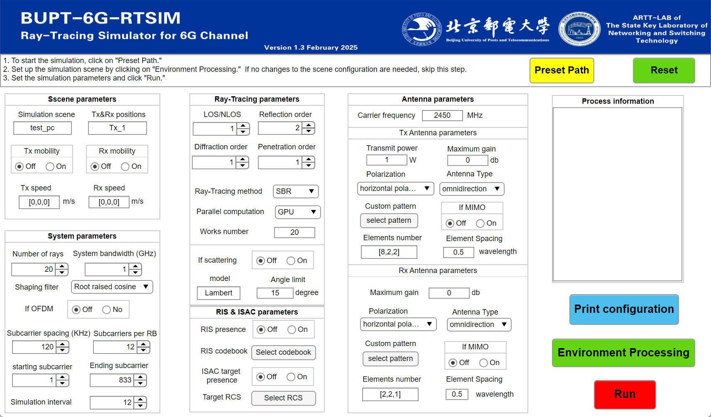

# MART-6G
This is the public repository of the Multi-Task Adaptive Ray-Tracing Platform for 6G (MART-6G) developed by Professor Jianhua Zhang's team at Beijing University of Posts and Telecommunications. MART-6G is a ray-tracing simulator designed for 6G, aiming to provide accurate and efficient wireless channels for the construction of 6G digital twin worlds. MART-6G consists of three modules: 
- **Environment Twin Module**: Responsible for reconstructing building geometry.  
- **RT Engine Module**: Integrates key algorithms including propagation, acceleration, calibration, and 6G-specific new features.  
- **Channel Generation Module**: Generates channel multipaths, parameters, and statistical distributions.

这是北京邮电大学张建华教授团队的 **面向多任务的射线追踪仿真平台** (MART-6G)的公开仓库。MART-6G是一款面向6G的射线追踪仿真器，旨在为为了6G数字孪生世界的搭建提供精确高效的无线信道。MART-6G包含三个模块:
- **环境孪生模块**负责重建建筑几何.
- **RT引擎模块**整合了传播、加速、校准、6G 特定的新功能等主要算法。
- **信道生成模块**负责生成信道多径、参数、统计分布。
## Platform Architecture
The platform's architecture is shown in the figure below. For a deeper understanding, please refer to the paper: "Road to 6G Digital Twin Networks: Multi-Task Adaptive Ray-Tracing as a Key Enabler". Link: [https://arxiv.org/abs/2502.14290](https://arxiv.org/abs/2502.14290)

平台的架构如下图所示，如想更进一步了解，欢迎查阅论文：Road to 6G Digital Twin Networks: Multi-Task Adaptive Ray-Tracing as a Key Enabler；链接：https://arxiv.org/abs/2502.14290

## Platform Features 平台特性
- **Comprehensive Radio Wave Propagation Model**: Built on the principles and techniques of ray tracing, the platform can accurately simulate signal propagation paths in various scenarios, including direct paths, reflection, penetration, high-order diffraction, and scattering mechanisms.
- **Support for User Customization**: Users can customize scenarios, material settings, and antenna parameters to obtain simulation results tailored to real-world application needs.
- **Support for 6G Emerging Technology Simulation**: The platform supports propagation models in the THz frequency band, channel-layer multiple-input multiple-output (MIMO) simulation, intelligent reflecting surface (RIS) simulation, and orthogonal frequency-division multiplexing (OFDM) simulation.
- **Hardware Acceleration Support**: The MATLAB version of the platform supports multi-core CPU computation, while the C++ version supports multi-core GPU computation.

- **全面电波传播模型**：平台基于射线追踪的原理和技术，能够精确模拟信号在各种场景中的传播路径，包括直射、反射、穿透、高阶绕射和散射等多种机制。
- **支持用户自定义**：用户都可以通过定制化的场景，材质设置和天线参数调整，获得符合实际应用需求的仿真结果。
- **支持6G新技术仿真**：平台支持太赫兹（THz）频段的传播模型，信道层的多输入多输出（MIMO）仿真，智能反射面（RIS）仿真，以及正交频分复用（OFDM）仿真。
- **支持硬件加速**：MATLAB版本的平台支持CPU多核计算；C++版本的平台支持GPU多核计算。

## User Interface 支持UI交互
Some features of the platform also support interaction via a UI. The UI interface of the current version is shown below.
平台的部分功能也支持通过UI的方式进行交互；当前版本UI界面如所示。

## How to Obtain the Full Code? 如何获取完整代码？
To protect certain rights of the developers, this repository only provides partial platform functionality (CPU single-core ray tracing for the MATLAB platform) along with a complete user manual (currently available only in Chinese). To access the full code, please contact me:
- Send an email to [yhmiao@bupt.edu.cn], stating your identity and intended use.
- I will review your request and reply with an invitation link to a private GitHub repository.

为了开发者的一些权益，本库只提供部分平台功能（MATLAB平台的cpu单核射线追踪）以及完整的用户手册（暂时只有中文）；需联系我获取：
- 发送邮件至 [yhmiao@bupt.edu.cn]，说明身份和使用意图。
- 我会在审核后回复并提供你github私人仓库的邀请链接
## Contact Information
- Email: [yhmiao@bupt.edu.cn]
## 联系方式
- 邮箱：[yhmiao@bupt.edu.cn]
  
